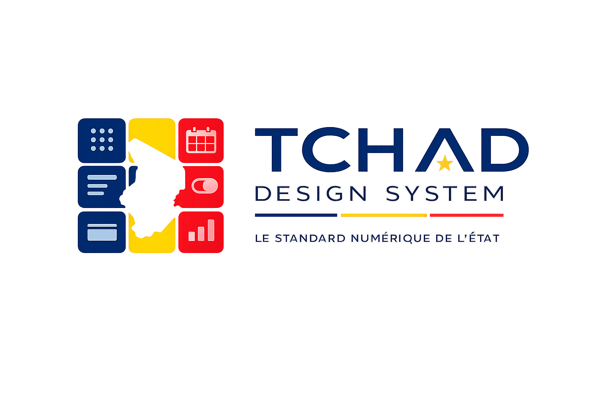

# TDS — Système de Design de l’État

> Le système de design open source destiné aux services numériques publics du Tchad.

[](https://github.com/wargafu/TDS/actions/workflows/ci.yml)
[](https://www.npmjs.com/package/@tds-tchad/core)
[](LICENSE)

---

<p align="center">
  
</p>

> [!IMPORTANT]
> TDS est actuellement une initiative indépendante et communautaire. Le projet vise une
> adoption par les institutions publiques tchadiennes, mais ne se présente pas encore comme
> une norme officiellement homologuée par l'État.

## Pourquoi TDS ?

Les services numériques gouvernementaux du Tchad manquent d'une identité visuelle cohérente. Chaque ministère, chaque plateforme citoyenne développe ses interfaces de manière indépendante — résultat : incohérence, inaccessibilité et perte de confiance des citoyens.

**TDS** propose une réponse systémique : une bibliothèque de tokens et de composants partagés, accessibles par défaut, conformes WCAG 2.1 AA, et prêts pour le français comme pour l'arabe.

Inspiré de [GOV.UK Design System](https://design-system.service.gov.uk/), [DSFR](https://www.systeme-de-design.gouv.fr/) et [USWDS](https://designsystem.digital.gov/).

---

## Ce que TDS fournit

### 🎨 Design Tokens
| Système | Variables CSS | TypeScript | JSON |
|---|---|---|---|
| Couleurs (bleu, jaune, rouge, vert, neutrals, sémantiques) | ✅ | ✅ | ✅ |
| Typographie (Source Sans 3, Noto Naskh Arabic, JetBrains Mono) | ✅ | ✅ | ✅ |
| Espacement (grille 4px) | ✅ | ✅ | ✅ |
| Arrondis, Ombres, Motion, Z-index | ✅ | ✅ | ✅ |

### 🧩 Composants
| Composant | Classes CSS | Types TS | Accessibilité |
|---|---|---|---|
| Button | `tds-button` | `ButtonVariant`, `ButtonSize` | WCAG AA ✅ |
| Input / Form | `tds-input`, `tds-field` | `InputVariant`, `InputSize` | WCAG AA ✅ |
| Alert | `tds-alert` | `AlertVariant` | `role=alert` ✅ |
| Badge | `tds-badge` | `BadgeVariant` | WCAG AA ✅ |
| Card | `tds-card` | `CardVariant` | ✅ |
| Link | `tds-link` | `LinkVariant` | Focus visible ✅ |
| Table | `tds-table` | — | `scope`, `caption` ✅ |
| Header | `tds-header` | `HeaderVariant` | Lien d'évitement recommandé ✅ |
| Navigation | `tds-nav` | — | `aria-current="page"` ✅ |
| Breadcrumb | `tds-breadcrumb` | — | `aria-current="page"` ✅ |
| Pagination | `tds-pagination` | — | `aria-label`, `aria-current` ✅ |
| Modal | `tds-modal` | `ModalSize` | Focus trap natif (`<dialog>`) ✅ |

---

## Installation

Le namespace npm `@tds-tchad` et les classes CSS `tds-*` constituent l'API stable
du projet (le package n'étant pas encore publié, aucune compatibilité
ascendante n'est requise avec l'ancien namespace `@dstd`).

```bash
# pnpm (recommandé)
pnpm add @tds-tchad/core

# npm
npm install @tds-tchad/core

# yarn
yarn add @tds-tchad/core
```

**Node.js 18+ requis.** Le package est distribué en ESM (`"type": "module"`).

---

## Démarrage rapide

### 1. Charger les tokens CSS

```css
/* Dans votre feuille de style principale */
@import "@tds-tchad/core/base.css";             /* Reset + styles HTML */
@import "@tds-tchad/core/tokens/color.css";
@import "@tds-tchad/core/tokens/typography.css";
@import "@tds-tchad/core/tokens/spacing.css";
@import "@tds-tchad/core/tokens/radius.css";
@import "@tds-tchad/core/tokens/shadow.css";
@import "@tds-tchad/core/tokens/motion.css";
@import "@tds-tchad/core/tokens/z-index.css";

/* Composants selon vos besoins */
@import "@tds-tchad/core/components/button/button.css";
@import "@tds-tchad/core/components/input/input.css";
@import "@tds-tchad/core/components/alert/alert.css";
@import "@tds-tchad/core/components/badge/badge.css";
@import "@tds-tchad/core/components/card/card.css";
@import "@tds-tchad/core/components/link/link.css";
@import "@tds-tchad/core/components/table/table.css";
```

### 2. Utiliser les composants en HTML

```html
<!-- Bouton primary -->
<button type="submit" class="tds-button tds-button--primary tds-button--md">
  Valider la demande
</button>

<!-- Champ de formulaire -->
<div class="tds-field">
  <label class="tds-field__label" for="nom">Nom complet</label>
  <input id="nom" type="text" class="tds-input tds-input--md" required>
</div>

<!-- Alerte succès -->
<div class="tds-alert tds-alert--success" role="status">
  <div class="tds-alert__content">
    <p class="tds-alert__title">Dossier soumis</p>
    <div class="tds-alert__body">Référence : REF-2024-001234</div>
  </div>
</div>
```

### 3. Utiliser les tokens TypeScript

```typescript
import { color, spacing, typography } from '@tds-tchad/core/tokens';
import type { ButtonVariant } from '@tds-tchad/core/components/button';

const primary = color.blue[500];      // '#0033A0'
const gap = spacing.scale[4];         // '1rem' (16px)
const body = typography.sizes.md;     // '1rem'
```

---

## Structure du monorepo

```
TDS/
├── packages/
│   └── core/                  ← Package npm principal @tds-tchad/core
│       ├── src/
│       │   ├── base.css       ← Reset CSS + styles HTML de base
│       │   ├── tokens/        ← Design tokens (TS + JSON + CSS)
│       │   └── components/    ← Tokens + CSS de chaque composant
│       ├── scripts/           ← Build, clean, validation
│       └── package.json
├── apps/
│   ├── docs/                  ← Site de documentation (Astro Starlight)
│   └── site/                  ← Site statique HTML de démonstration
├── templates/                 ← Templates gouvernementaux (à venir)
├── .github/workflows/ci.yml   ← CI/CD GitHub Actions
├── turbo.json                 ← Orchestration Turbo
└── pnpm-workspace.yaml
```

---

## Développement local

### Prérequis

- [Node.js](https://nodejs.org/) 18+
- [pnpm](https://pnpm.io/) 8+ : `npm install -g pnpm`

### Installation

```bash
git clone https://github.com/wargafu/TDS.git
cd TDS
pnpm install
```

### Commandes principales

```bash
# Lancer le site de documentation en local
cd apps/docs && npm run dev
# → http://localhost:4321

# Builder tous les packages
pnpm build

# Vérifier les types TypeScript
pnpm typecheck

# Valider les tokens (73 checks)
pnpm --filter @tds-tchad/core validate:tokens

# Valider les exports npm (après build)
pnpm --filter @tds-tchad/core validate:exports

# Lint
pnpm lint

# Formatter le code
pnpm format
```

### Workflow de développement

```bash
# 1. Créer une branche feature
git checkout -b feat/nom-du-composant

# 2. Développer + valider
pnpm --filter @tds-tchad/core validate:tokens
pnpm build
pnpm typecheck

# 3. Committer
git commit -m "feat: ajouter le composant X"

# 4. Ouvrir une Pull Request vers main
git push origin feat/nom-du-composant
```

---

## Contribuer

**Toute contribution est bienvenue.** TDS est un bien numérique commun pour le Tchad.

### Avant d'ouvrir une PR

- [ ] Les tokens ajoutés existent en `.ts`, `.json` ET `.css`
- [ ] `pnpm --filter @tds-tchad/core validate:tokens` passe à 0 erreur
- [ ] `pnpm build && pnpm --filter @tds-tchad/core validate:exports` réussit
- [ ] `pnpm typecheck` → zéro erreur TypeScript
- [ ] `pnpm --filter @tds-tchad/core test` et `lint:css` passent
- [ ] Les composants respectent WCAG 2.1 AA (contraste, focus, ARIA) — `cd apps/docs && npm run test:a11y`
- [ ] La documentation est mise à jour dans `apps/docs/` (page composant + terrain de jeu)

### Types de contributions acceptées

| Type | Processus |
|---|---|
| 🐛 Correction de bug | PR directe avec description du bug |
| ♿ Amélioration accessibilité | PR avec tests AT décrits |
| 🎨 Nouveau token | Ouvrir une issue d'abord |
| 🧩 Nouveau composant | RFC obligatoire — discussion issue |
| 📚 Documentation | PR directe |
| 🌐 Traduction arabe | PR directe — contactez les mainteneurs |

### Ce qui est interdit sans version majeure

- Modifier la valeur d'un token existant
- Supprimer un export public
- Renommer une classe CSS existante

> TDS suit le versionnement sémantique strict. Les tokens publiés sont **immuables**.

### Guide de contribution complet

→ [docs/guidelines/contributing](/apps/docs/src/content/docs/guidelines/contributing.mdx)

---

## Feuille de route

### v0.1 — Fondations ✅
- [x] 7 systèmes de tokens (couleurs, typo, espacement, radius, shadow, motion, z-index)
- [x] 7 composants (Button, Input, Alert, Badge, Card, Link, Table)
- [x] Build system industriel + CI/CD
- [x] Documentation Astro Starlight
- [x] Pipeline de génération de tokens à source unique, tests automatisés, stylelint, vérifications a11y (axe-core)

### v0.2 — Composants navigation ✅ (actuel)
- [x] Header gouvernemental
- [x] Navigation principale
- [x] Breadcrumb
- [x] Pagination
- [x] Modal / Dialog

### v0.3 — Patterns et templates
- [ ] Template portail citoyen
- [ ] Template tableau de bord administratif
- [x] Terrain de jeu visuel des composants (`apps/docs/src/pages/playground.astro`)

### v1.0 — Production ready
- [ ] Dark mode complet
- [ ] Système d'icônes SVG
- [ ] Support arabe RTL complet et testé
- [ ] Publication npm `@tds-tchad/core`

---

## Compatibilité

| Environnement | Support |
|---|---|
| HTML + CSS (sans JS) | ✅ Complet |
| React 18+ | ✅ Via classes CSS |
| Vue 3+ | ✅ Via classes CSS |
| Angular | ✅ Via classes CSS |
| Next.js / Nuxt / Astro | ✅ Via classes CSS |
| Node.js (tokens JSON/JS) | ✅ |
| Navigateurs modernes (2 dernières versions) | ✅ |
| IE11 | ❌ Non supporté |

---

## Stack technique

| Outil | Usage |
|---|---|
| [pnpm](https://pnpm.io/) + [Turbo](https://turbo.build/) | Monorepo et orchestration |
| [TypeScript 5.6](https://www.typescriptlang.org/) | Tokens typés |
| [Astro](https://astro.build/) + [Starlight](https://starlight.astro.build/) | Documentation |
| [GitHub Actions](https://github.com/features/actions) | CI/CD |
| [ESLint](https://eslint.org/) + [Prettier](https://prettier.io/) | Qualité du code |

---

## Licence

[MIT](LICENSE) — Libre d'utilisation pour tous les projets, y compris gouvernementaux.

---

## Contact

- **Issues** : [github.com/wargafu/TDS/issues](https://github.com/wargafu/TDS/issues)
- **Discussions** : [github.com/wargafu/TDS/discussions](https://github.com/wargafu/TDS/discussions)
- **Email** : design-system@gouv.td *(à configurer)*

---

<div align="center">
  Construit pour le Tchad 🇹🇩 — Libre pour tous
</div>
