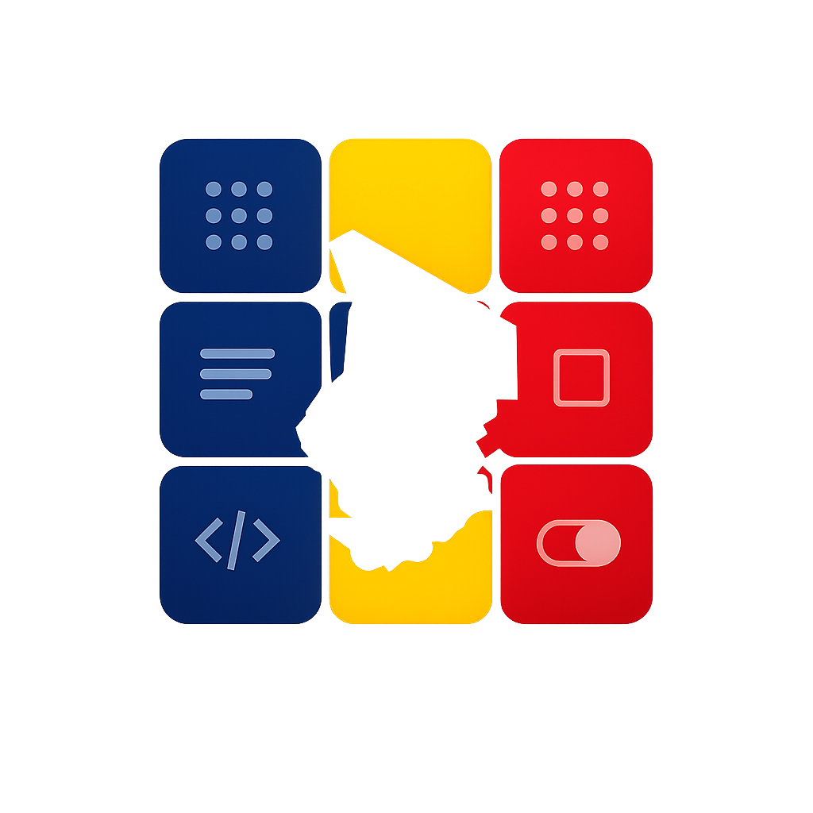

# TDGS — Tchad Design System

> Système de design open source proposé pour les services numériques publics du Tchad.

[](https://github.com/kisaigo/TDGS/actions/workflows/ci.yml)
[](#installation)
[](LICENSE)

---

<p align="center">
  
</p>

> [!IMPORTANT]
> TDGS est actuellement une initiative indépendante et communautaire. Le projet vise une
> adoption par les institutions publiques tchadiennes, mais ne se présente pas encore comme
> une norme officiellement homologuée par l'État.

## Pourquoi TDGS ?

Les services numériques gouvernementaux du Tchad manquent d'une identité visuelle cohérente. Chaque ministère, chaque plateforme citoyenne développe ses interfaces de manière indépendante — résultat : incohérence, inaccessibilité et perte de confiance des citoyens.

**TDGS** propose une réponse systémique : une bibliothèque de tokens et de composants partagés,
conçus selon une cible WCAG 2.2 AA, avec des contrôles automatisés partiels, et prêts pour le
français comme pour l'arabe.

Inspiré de [GOV.UK Design System](https://design-system.service.gov.uk/), [DSFR](https://www.systeme-de-design.gouv.fr/) et [USWDS](https://designsystem.digital.gov/).

---

## Ce que TDGS fournit

### 🎨 Design Tokens

| Système                                                        | Variables CSS | TypeScript | JSON |
| -------------------------------------------------------------- | ------------- | ---------- | ---- |
| Couleurs (bleu, jaune, rouge, vert, neutrals, sémantiques)     | ✅            | ✅         | ✅   |
| Typographie (Source Sans 3, Noto Naskh Arabic, JetBrains Mono) | ✅            | ✅         | ✅   |
| Espacement (grille 4px)                                        | ✅            | ✅         | ✅   |
| Arrondis, Ombres, Motion, Z-index                              | ✅            | ✅         | ✅   |

### 🧩 Composants

| Composant         | Classes CSS              | Types TS                      | Accessibilité                                   |
| ----------------- | ------------------------ | ----------------------------- | ----------------------------------------------- |
| Button            | `tds-button`             | `ButtonVariant`, `ButtonSize` | Focus et états testés ✅                        |
| Input / Form      | `tds-input`, `tds-field` | `InputVariant`, `InputSize`   | Labels et ARIA testés ✅                        |
| Alert             | `tds-alert`              | `AlertVariant`                | `role=alert` ✅                                 |
| Badge             | `tds-badge`              | `BadgeVariant`                | Variantes sémantiques ✅                        |
| Card              | `tds-card`               | `CardVariant`                 | ✅                                              |
| Link              | `tds-link`               | `LinkVariant`                 | Focus visible ✅                                |
| Table             | `tds-table`              | —                             | `scope`, `caption` ✅                           |
| Header            | `tds-header`             | `HeaderVariant`               | Lien d'évitement recommandé ✅                  |
| Navigation        | `tds-nav`                | —                             | `aria-current="page"` ✅                        |
| Breadcrumb        | `tds-breadcrumb`         | —                             | `aria-current="page"` ✅                        |
| Pagination        | `tds-pagination`         | —                             | `aria-label`, `aria-current` ✅                 |
| Modal             | `tds-modal`              | `ModalSize`                   | Focus trap natif (`<dialog>`) ✅                |
| Skip Link         | `tds-skip-link`          | —                             | Premier élément focusable ✅                    |
| Footer            | `tds-footer`             | —                             | Lien déclaration d'accessibilité ✅             |
| Accordion         | `tds-accordion`          | —                             | `<details>`/`<summary>` natif, zéro JS ✅       |
| Tabs              | `tds-tabs`               | —                             | WAI-ARIA APG (roving tabindex) ✅               |
| Tooltip           | `tds-tooltip`            | —                             | CSS pur, limitation tactile documentée ⚠️       |
| Recherche         | `tds-search`             | `SearchField`                 | `searchbox` natif, libellé obligatoire ✅       |
| Étapes            | `tds-stepper`            | `Stepper`                     | `aria-current="step"` ✅                        |
| Dépôt de fichier  | `tds-file-upload`        | `FileUpload`                  | `input[type=file]`, erreurs associées ✅        |
| Progression       | `tds-progress`           | `Progress`                    | `role=progressbar`, valeurs ARIA ✅             |
| Callout           | `tds-callout`            | `CalloutVariant`              | Titre structuré, variantes sémantiques ✅       |
| Notice            | `tds-notice`             | `NoticeVariant`               | Annonce status/alert, fermeture accessible ✅   |
| Tag               | `tds-tag`                | `TagVariant`, `TagSize`       | Texte explicite, suppression accessible ✅      |
| Tile              | `tds-tile`               | `TileVariant`                 | Lien unique, focus visible ✅                   |
| Download          | `tds-download`           | —                             | Lien explicite et métadonnées ✅                |
| Quote             | `tds-quote`              | —                             | Citation sémantique avec source ✅              |
| Summary           | `tds-summary`            | `SummaryItem`                 | Navigation structurée et libellée ✅            |
| Mot de passe      | `tds-password`           | `FieldSize`                   | Bascule afficher/masquer annoncée ✅            |
| Curseur de plage  | `tds-range`              | —                             | `input[type=range]` natif, valeur accessible ✅ |
| Contrôle segmenté | `tds-segmented`          | `SegmentedOption`             | `radiogroup` natif, clavier ✅                  |
| Menu déroulant    | `tds-dropdown`           | —                             | `aria-haspopup`/`aria-expanded` ✅              |
| Menu latéral      | `tds-sidemenu`           | `SidemenuItem`                | `aria-current=\"page\"`, focus visible ✅       |
| Partage           | `tds-share`              | `ShareNetwork`                | Liens libellés, `target=_blank` ✅              |
| Bloc de marque    | `tds-logo`               | —                             | Marque décorative, variante fond sombre ✅      |

Le composant `Icon` fournit en complément un jeu initial d'icônes SVG indépendantes, utilisables
avec les thèmes TDGS.

---

## Installation

Le namespace npm `@tdgs` et les classes CSS `tds-*` constituent l'API publique
du projet. Les packages sont prêts à être publiés, mais aucune publication npm
n'a encore été effectuée. Les commandes ci-dessous sont donc la cible d'installation
pour la première publication ; dans le monorepo, utilisez `pnpm install`.

```bash
# pnpm (recommandé)
pnpm add @tdgs/core

# Optionnel : bindings framework
pnpm add @tdgs/react react
pnpm add @tdgs/vue vue

# npm
npm install @tdgs/core

# yarn
yarn add @tdgs/core
```

**Node.js 18+ requis.** Le package est distribué en ESM (`"type": "module"`).

---

## Démarrage rapide

### 1. Charger les tokens CSS

```css
/* Dans votre feuille de style principale */
@import '@tdgs/core/tdgs.css'; /* Socle complet en une ligne */

/* Ou importer les fichiers ci-dessous individuellement pour réduire le bundle */
@import '@tdgs/core/base.css'; /* Reset + styles HTML */
@import '@tdgs/core/tokens/color.css';
@import '@tdgs/core/tokens/typography.css';
@import '@tdgs/core/tokens/spacing.css';
@import '@tdgs/core/tokens/radius.css';
@import '@tdgs/core/tokens/shadow.css';
@import '@tdgs/core/tokens/motion.css';
@import '@tdgs/core/tokens/z-index.css';

/* Composants selon vos besoins */
@import '@tdgs/core/components/button/button.css';
@import '@tdgs/core/components/input/input.css';
@import '@tdgs/core/components/alert/alert.css';
@import '@tdgs/core/components/badge/badge.css';
@import '@tdgs/core/components/card/card.css';
@import '@tdgs/core/components/link/link.css';
@import '@tdgs/core/components/table/table.css';
@import '@tdgs/core/components/header/header.css';
@import '@tdgs/core/components/nav/nav.css';
@import '@tdgs/core/components/breadcrumb/breadcrumb.css';
@import '@tdgs/core/components/pagination/pagination.css';
@import '@tdgs/core/components/modal/modal.css';
@import '@tdgs/core/components/skip-link/skip-link.css';
@import '@tdgs/core/components/footer/footer.css';
@import '@tdgs/core/components/accordion/accordion.css';
@import '@tdgs/core/components/tabs/tabs.css';
@import '@tdgs/core/components/tooltip/tooltip.css';
@import '@tdgs/core/components/search/search.css';
@import '@tdgs/core/components/stepper/stepper.css';
@import '@tdgs/core/components/file-upload/file-upload.css';
@import '@tdgs/core/components/progress/progress.css';
@import '@tdgs/core/components/callout/callout.css';
@import '@tdgs/core/components/notice/notice.css';
@import '@tdgs/core/components/tag/tag.css';
@import '@tdgs/core/components/tile/tile.css';
@import '@tdgs/core/components/download/download.css';
@import '@tdgs/core/components/quote/quote.css';
@import '@tdgs/core/components/summary/summary.css';
```

### 2. Utiliser les composants en HTML

```html
<!-- Bouton primary -->
<button type="submit" class="tds-button tds-button--primary tds-button--md">
  Valider la demande
</button>

<!-- Champ de formulaire -->
<div class="tds-field">
  <label class="tds-field__label" for="nom">Nom complet</label>
  <input id="nom" type="text" class="tds-input tds-input--md" required />
</div>

<!-- Alerte succès -->
<div class="tds-alert tds-alert--success" role="status">
  <div class="tds-alert__content">
    <p class="tds-alert__title">Dossier soumis</p>
    <div class="tds-alert__body">Référence : REF-2024-001234</div>
  </div>
</div>
```

### 3. Utiliser les tokens TypeScript

```typescript
import { color, spacing, typography } from '@tdgs/core/tokens';
import type { ButtonVariant } from '@tdgs/core/components/button';

const primary = color.blue[500]; // '#0B3A82'
const gap = spacing.scale[4]; // '1rem' (16px)
const body = typography.sizes.md; // '1rem'
```

---

## Structure du monorepo

```
TDGS/
├── packages/
│   └── core/                  ← Package npm principal @tdgs/core
│       ├── src/
│       │   ├── base.css       ← Reset CSS + styles HTML de base
│       │   ├── tokens/        ← Design tokens (TS + JSON + CSS)
│       │   └── components/    ← Tokens + CSS de chaque composant
│       ├── scripts/           ← Build, clean, validation
│       └── package.json
├── apps/
│   ├── docs/                  ← Site de documentation (Astro Starlight)
│   └── site/                  ← Site statique HTML de démonstration
├── templates/                 ← Templates gouvernementaux (à venir)
├── .github/workflows/ci.yml   ← CI/CD GitHub Actions
├── turbo.json                 ← Orchestration Turbo
└── pnpm-workspace.yaml
```

---

## Développement local

### Prérequis

- [Node.js](https://nodejs.org/) 18+
- [pnpm](https://pnpm.io/) 8+ : `npm install -g pnpm`

### Installation

```bash
git clone https://github.com/kisaigo/TDGS.git
cd TDGS
pnpm install
```

### Commandes principales

```bash
# Lancer le site de documentation en local
cd apps/docs && npm run dev
# → http://localhost:4321

# Builder tous les packages
pnpm build

# Vérifier les types TypeScript
pnpm typecheck

# Valider les tokens (137 checks)
pnpm --filter @tdgs/core validate:tokens

# Valider les exports npm (après build)
pnpm --filter @tdgs/core validate:exports

# Lint
pnpm lint

# Formatter le code
pnpm format
```

### Workflow de développement

```bash
# 1. Créer une branche feature
git checkout -b feat/nom-du-composant

# 2. Développer + valider
pnpm --filter @tdgs/core validate:tokens
pnpm build
pnpm typecheck

# 3. Committer
git commit -m "feat: ajouter le composant X"

# 4. Ouvrir une Pull Request vers main
git push origin feat/nom-du-composant
```

---

## Contribuer

**Toute contribution est bienvenue.** TDGS est un bien numérique commun pour le Tchad.

### Avant d'ouvrir une PR

- [ ] Les tokens ajoutés existent en `.ts`, `.json` ET `.css`
- [ ] `pnpm --filter @tdgs/core validate:tokens` passe à 0 erreur
- [ ] `pnpm build && pnpm --filter @tdgs/core validate:exports` réussit
- [ ] `pnpm typecheck` → zéro erreur TypeScript
- [ ] `pnpm --filter @tdgs/core test` et `lint:css` passent
- [ ] Un audit complet WCAG 2.2 AA est réalisé — `pnpm --filter tds-docs test:a11y` ne constitue qu'un contrôle automatisé partiel
- [ ] La documentation est mise à jour dans `apps/docs/` (page composant + terrain de jeu)

### Types de contributions acceptées

| Type                          | Processus                              |
| ----------------------------- | -------------------------------------- |
| 🐛 Correction de bug          | PR directe avec description du bug     |
| ♿ Amélioration accessibilité | PR avec tests AT décrits               |
| 🎨 Nouveau token              | Ouvrir une issue d'abord               |
| 🧩 Nouveau composant          | RFC obligatoire — discussion issue     |
| 📚 Documentation              | PR directe                             |
| 🌐 Traduction arabe           | PR directe — contactez les mainteneurs |

### Ce qui est interdit sans version majeure

- Modifier la valeur d'un token existant
- Supprimer un export public
- Renommer une classe CSS existante

> TDGS suit le versionnement sémantique strict. Les tokens publiés sont **immuables**.

### Guide de contribution complet

→ [docs/communaute/contribution](/apps/docs/src/content/docs/communaute/contribution.mdx)

---

## Feuille de route

### v0.1 — Fondations ✅

- [x] 7 systèmes de tokens (couleurs, typo, espacement, radius, shadow, motion, z-index)
- [x] 35 composants (Button, Input, Alert, Badge, Card, Link, Table, Header, Navigation, Breadcrumb, Pagination, Modal, Skip Link, Footer, Accordion, Tabs, Tooltip, Recherche, Étapes, Dépôt de fichier, Progression, Callout, Notice, Tag, Tile, Download, Quote, Summary, Mot de passe, Curseur de plage, Contrôle segmenté, Menu déroulant, Menu latéral, Partage, Bloc de marque)
- [x] Build system industriel + CI/CD
- [x] Documentation Astro Starlight
- [x] Pipeline de génération de tokens à source unique, tests automatisés, stylelint, vérifications a11y (axe-core)

### v0.2 — Composants et parcours ✅ (actuel)

- [x] Header gouvernemental
- [x] Navigation principale
- [x] Breadcrumb
- [x] Pagination
- [x] Modal / Dialog

### v0.3 — Patterns et templates

- [x] Template portail citoyen (`templates/citizen-portal/`)
- [x] Template tableau de bord administratif (`templates/admin-dashboard/`)
- [x] Terrain de jeu visuel des composants (`apps/docs/src/pages/playground.astro`)

### v1.0 — Production ready

- [ ] Dark mode complet
- [x] Système d'icônes SVG initial (`Icon`)
- [ ] Support arabe RTL complet et testé
- [ ] Publication npm `@tdgs/core`, `@tdgs/react` et `@tdgs/vue`

---

## Compatibilité

| Environnement                               | Support                       |
| ------------------------------------------- | ----------------------------- |
| HTML + CSS (sans JS)                        | ✅ Complet                    |
| React 18+                                   | ✅ Binding typé `@tdgs/react` |
| Vue 3+                                      | ✅ Binding typé `@tdgs/vue`   |
| Angular                                     | ✅ Via classes CSS            |
| Next.js / Nuxt / Astro                      | ✅ Via classes CSS            |
| Node.js (tokens JSON/JS)                    | ✅                            |
| Navigateurs modernes (2 dernières versions) | ✅                            |
| IE11                                        | ❌ Non supporté               |

---

## Stack technique

| Outil                                                                       | Usage                     |
| --------------------------------------------------------------------------- | ------------------------- |
| [pnpm](https://pnpm.io/) + [Turbo](https://turbo.build/)                    | Monorepo et orchestration |
| [TypeScript 5.6](https://www.typescriptlang.org/)                           | Tokens typés              |
| [Astro](https://astro.build/) + [Starlight](https://starlight.astro.build/) | Documentation             |
| [GitHub Actions](https://github.com/features/actions)                       | CI/CD                     |
| [ESLint](https://eslint.org/) + [Prettier](https://prettier.io/)            | Qualité du code           |

---

## Licence

[MIT](LICENSE) — Libre d'utilisation pour tous les projets, y compris gouvernementaux.

---

## Contact

- **Issues** : [github.com/kisaigo/TDGS/issues](https://github.com/kisaigo/TDGS/issues)
- **Discussions** : [github.com/kisaigo/TDGS/discussions](https://github.com/kisaigo/TDGS/discussions)
- **Email** : design-system@gouv.td _(à configurer)_

---

<div align="center">
  Construit pour le Tchad 🇹🇩 — Libre pour tous
</div>
